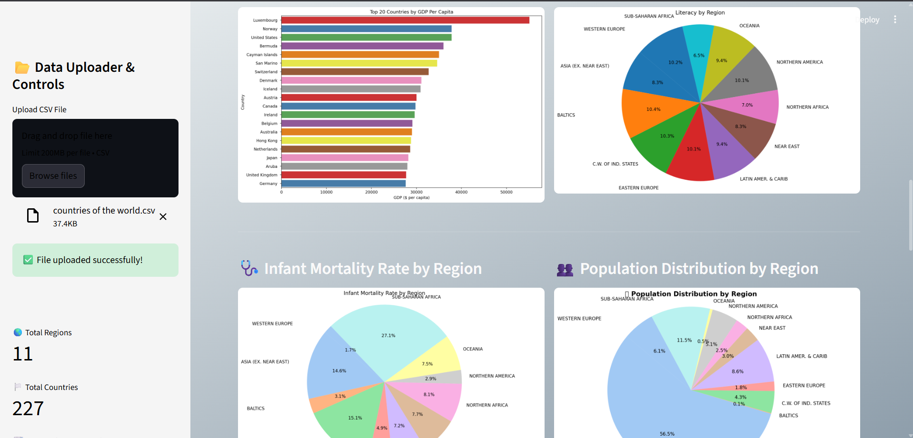

# 🌍 Global GDP Analysis & Prediction Dashboard

A powerful **Streamlit-based interactive dashboard** for analyzing, visualizing, and predicting **GDP per capita** across world regions.  
It uses advanced data preprocessing, aggregation, and visualization techniques to uncover meaningful global insights.

---

## 🚀 Features

- 📤 Upload your own CSV dataset  
- 🧮 Automatic data cleaning and preprocessing  
- 💡 GDP prediction using a trained ML model (`.sav` file)  
- 📊 Interactive visualizations:
  - Top 20 Countries by GDP
  - Population Distribution by Region
  - Literacy and Infant Mortality Rate Charts
  - Correlation Heatmap
  - Regional GDP Pie Charts
- 🌏 Clean, responsive, and gradient-themed UI using Streamlit

---

## 🖼️ Preview

